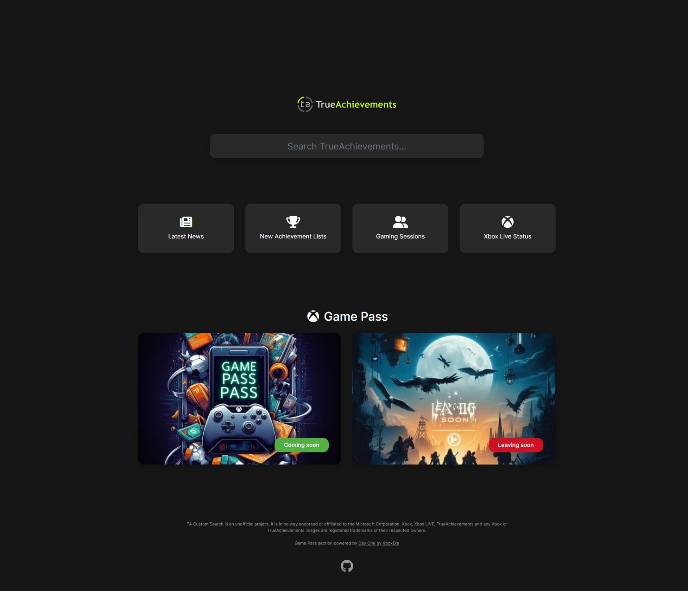

# TA Custom Search
TA Custom Search is custom a homepage for your browser. It is specifically created for achievement hunters on [TrueAchievements](https://www.trueachievements.com/). 

Looking for TrueTrophies? That can be found [here](https://github.com/Jabser/TT-Custom-Search).

---

### How to use

**Live Version**

For the most up to date version of the start page use this [link](https://jabser.github.io/TA-Custom-Search/) & set it as your homepage.

**Manual**

If you would rather set it up locally you can download the file [here](https://raw.githubusercontent.com/Jabser/TA-Custom-Search/master/docs/index.html) & configure it as your homepage.

---

### Browser extensions
**Coming Soon**

A way to instantly search on TrueAchievements without leaving your current website.

- Chrome
- Edge
- Firefox

---

### Feature Requests/Pull Requests

**Feature Requests**

Got an idea for a new feature or improvements? Post it here with the correct label.
- [Feature Requests](https://github.com/Jabser/TA-Custom-Search/issues)

**Pull Requests**

Improvements to the code/design is greatly appreciated. Create a new pull request and I will have a look at it.
- [Pull Requests](https://github.com/Jabser/TA-Custom-Search/pulls)

**Have any other questions?**

- [Create a GitHub issue with the correct label for help](https://github.com/Jabser/TA-Custom-Search/issues)

---

### Disclaimer
TA Custom Search is an unofficial project, it is in no way endorsed or affiliated to the Microsoft Corporation, Xbox, Xbox LIVE, TrueAchievements and any Xbox or TrueAchievements images are registered trademarks of their respected owners.
